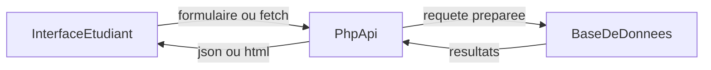

# Guide d’accompagnement — projet final (IM4DDW)

Ce document est un **guide autonome** pour avancer sur ton projet final **en parallèle du cours**. Il ne remplace pas les séances : il te donne une méthode, des garde-fous et des pistes techniques quand tu es bloqué avant d’avoir vu toutes les notions (BDD, API, Docker, etc.).

> **Référence technique d’exemple** : le dépôt contient le projet **[film-library](./film-library/)** (PHP, base de données, API JSON, front statique). Tu peux t’en inspirer pour la structure, pas pour copier-coller sans comprendre.

---

## 1. Pourquoi ce document existe

- Le **cours** et le **projet** avancent en même temps : tu n’es pas obligé d’attendre la dernière séance sur les API pour commencer.
- Une bonne stratégie est de travailler par **petites étapes livrables** (une page qui marche, un formulaire, une liste, une API, etc.).
- Ce guide te donne une **checklist alignée sur l’évaluation** et des **questions à te poser** avant d’écrire du SQL ou du PHP.

---

## 2. Ce que ton projet doit absolument contenir

Ces attentes correspondent au module **IM4DDW — Développement Web** (voir la présentation du module dans les slides) et aux critères d’évaluation.

**Ressource métier** — Le *métier* désigne le **domaine** de ton application (films, tâches, réservations, articles…). Une **ressource métier** est une **entité centrale** de ce domaine que l’utilisateur crée, consulte et gère dans l’appli : par exemple un film dans une bibliothèque, une tâche dans un todo, une réservation. Ce n’est en général **pas** uniquement un compte technique (`utilisateur`) ou un paramètre : l’évaluation attend un **CRUD** (créer, lire, mettre à jour, supprimer) sur **au moins une** entité qui porte le **sujet** de ton projet.

### Technologies imposées (rappel)


| Couche         | Attendu                                                                    |
| -------------- | -------------------------------------------------------------------------- |
| **Frontend**   | HTML5, CSS3, **JavaScript vanilla** (pas de React, Vue, etc.)              |
| **Backend**    | **PHP** avec **POO** ; **MVC recommandé** mais pas obligatoire             |
| **BDD**        | **MySQL** ou **PostgreSQL**                                                |
| **API**        | **Au moins un endpoint REST** qui renvoie du **JSON**                      |
| **Frameworks** | **Pas** de Laravel, Symfony, etc. (objectif : comprendre les fondamentaux) |


**CSS** : l’usage de **Bootstrap** ou **Tailwind** (souvent via CDN) est autorisé pour gagner du temps sur la mise en forme.

### Checklist « projet qui tient la route »

Utilise-la pour prioriser : **mieux vaut un projet simple et fini** qu’un projet ambitieux à moitié cassé.

- **Pages** HTML structurées (titres, sections, formulaires quand c’est nécessaire)
- **Mise en forme** CSS cohérente et **responsive** (mobile / desktop)
- **JavaScript** : interactions (DOM, événements) et/ou **requêtes asynchrones** (`fetch`) vers ton API
- **Backend PHP** : logique serveur, idéalement organisée (fichiers séparés, classes si tu fais de la POO)
- **Base de données** : schéma clair (tables, relations), requêtes **SQL** avec **requêtes préparées** (PDO)
- **CRUD** sur au moins une ressource métier (créer / lire / mettre à jour / supprimer)
- **API JSON** : au moins un endpoint REST documenté (méthode HTTP, URL, corps attendu, réponses)
- **Sécurité minimale** : mots de passe **hashés** si tu fais de l’auth ; prudence avec les entrées utilisateur (voir cours sur l’échappement / XSS)
- **Git** : historique de commits, dépôt (GitHub ou équivalent) pour le livrable code
- **Démo** : tu dois pouvoir montrer le projet **sans installation live le jour J** (vidéo ou machine prête)

### Livrables (voir slides sur la présentation du module)

- Code source versionné (**Git** / **GitHub**)
- **8 à 10 slides** pour la soutenance
- **Démonstration** (live ou vidéo)
- Oral : contexte, choix techniques, démo, difficultés, améliorations possibles

**Projet individuel** (pas de binôme). L’aide par IA (ChatGPT, Copilot, Cursor…) est possible si tu **comprends** ce que tu intègres et que tu peux l’**expliquer**.

---

## 3. Choisir un projet réaliste

### Méthode rapide

1. **Problème** : quelle petite chose ennuyeuse ton appli pourrait simplifier ?
2. **Utilisateur** : qui utilise l’appli ? (toi, un admin, le public…)
3. **3 fonctionnalités minimales** (pas plus au début) : ex. « lister mes films », « ajouter un film », « marquer comme vu ».
4. **2 bonus maximum** pour plus tard : statistiques, export, API externe, etc.

### Exemples de thèmes (voir aussi la slide « 6 projets au choix »)

Gestionnaire de tâches, bibliothèque de films, réservation, blog, événements, portfolio avec admin… ou **projet personnel**, tant qu’il couvre bien **toutes** les compétences du module.

---

## 4. Avancer avant la fin du cours (feuille de route)

Tu peux enchaîner ces étapes **sans attendre** que chaque chapitre soit vu en cours. L’ordre est volontairement « vertical slice » : à chaque étape tu as quelque chose de **démontrable**.


| Étape | Tu produis…                                       | Débloque…                                       |
| ----- | ------------------------------------------------- | ----------------------------------------------- |
| **1** | Maquettes HTML + CSS (même statiques)             | Structure, navigation, responsive               |
| **2** | JS local (DOM, événements) sans serveur           | Interactivité, logique client                   |
| **3** | Formulaires + validation côté client              | UX, préparation des données envoyées au serveur |
| **4** | Schéma BDD (papier ou fichier `.sql`)             | Tables, relations, contraintes                  |
| **5** | PHP + connexion BDD (PDO)                         | Persistance                                     |
| **6** | CRUD sur une ressource                            | Cœur métier                                     |
| **7** | Endpoints qui renvoient du **JSON**               | API consommée par `fetch`                       |
| **8** | Auth (session, login) **si** ton sujet l’exige    | Comptes utilisateurs                            |
| **9** | Finitions, tests manuels, README projet, **démo** | Soutenance                                      |


Quand une étape bloque, descends d’un cran : par ex. une API qui ne fait que `GET` une liste fixe en JSON, puis tu branches la BDD.

### Étape 1 — Maquettes HTML + CSS (même statiques)

**Ce qui est attendu**

- Des **pages HTML** qui représentent ton application : au minimum une page d’accueil ou liste, une page de détail ou formulaire, une navigation cohérente (menu ou liens).
- Une **structure sémantique** raisonnable (`header`, `main`, `section`, titres hiérarchiques) plutôt qu’une soupe de `<div>`.
- Du **CSS** qui donne une identité visuelle lisible : espacements, typographie, couleurs, états de survol sur les boutons.
- Un rendu **utilisable sur mobile et sur grand écran** (même simple : une colonne sur petit écran, grille ou largeur max sur desktop).

**Conseils pour réussir**

- Commence par **le contenu** : quels textes, quels champs, quels boutons — le design viendra après.
- Définis une **grille ou une largeur max** (`max-width`) pour éviter les lignes illisibles sur très grands écrans.
- Teste tôt en **redimensionnant la fenêtre** du navigateur ; tu verras vite les problèmes de navigation ou de formulaires trop larges.
- Si tu utilises **Bootstrap / Tailwind**, limite-toi à ce dont tu as besoin pour ne pas te perdre dans la doc.
- Garde le **HTML/CSS sans PHP** au début : tu peux ouvrir les fichiers en local ou avec Live Server ; la connexion serveur viendra plus tard.

### Étape 2 — Interactions JavaScript locales (sans serveur)

**Ce qui est attendu**

- Du **JavaScript vanilla** qui réagit aux actions utilisateur : clics, saisie, changement de sélection.
- Des **modifications du DOM** : afficher/masquer une zone, mettre à jour un texte, ajouter une ligne dans une liste, message d’erreur à côté d’un champ.
- Une **logique minimale** isolée dans des fonctions (même dans un seul fichier au début).

**Conseils pour réussir**

- Utilise `**addEventListener`** plutôt que des attributs `onclick` partout : plus facile à maintenir.
- Vérifie dans la **console** du navigateur (`F12`) : une erreur JS peut bloquer tout le script.
- Simule des **données factices** en JavaScript (tableau d’objets en dur) pour tester listes et filtres **avant** la BDD.
- Prépare des **fonctions réutilisables** du type « rendre une carte » ou « vider un conteneur » : tu les réutiliseras quand les données viendront de l’API.

### Étape 3 — Formulaires et validation côté client

**Ce qui est attendu**

- Des `**<form>`** (ou champs contrôlés par JS) pour créer ou modifier des ressources.
- Des **labels** associés aux champs (`for` / `id`), des types adaptés (`email`, `number`, `date`…).
- Une **validation utilisateur** avant envoi : champs obligatoires, formats plausibles, messages clairs (sans remplacer la validation serveur plus tard).

**Conseils pour réussir**

- Distingue **validation UX** (vite, côté navigateur) et **validation sécurité** (indispensable côté PHP, étape suivante).
- Pour l’instant tu peux intercepter l’envoi avec `**preventDefault()`** et afficher un résumé en JSON dans la console : tu prépares le contrat de données.
- Pense au **parcours erreur** : bordure rouge, message sous le champ, focus sur le premier problème.
- Si ton projet utilisera du JSON vers PHP, garde la même **forme d’objet** que tu enverras plus tard avec `fetch`.

### Étape 4 — Schéma de base de données (papier ou `.sql`)

**Ce qui est attendu**

- Une **liste d’entités** et leurs attributs, puis des **tables** avec types et contraintes de base.
- Les **relations** explicites : clés étrangères, cardinalités (1—N, N—N avec table de liaison si besoin).
- Un fichier `**schema.sql`** (ou équivalent) versionné, qui permet de recréer la structure sur une machine vierge.

**Conseils pour réussir**

- Suis la **section 7** de ce guide (questionnement) avant d’écrire le SQL.
- Commence **petit** : 3–4 tables bien pensées valent mieux que 15 tables incomplètes.
- Note les **requêtes que tu voudras faire** (« liste des X pour l’utilisateur Y ») : si une jointure est pénible, revois peut-être le modèle.
- Garde une **convention de nommage** stable (`snake_case`, pluriel ou singulier pour les tables — choisis et tiens-toi-y).

### Étape 5 — PHP et connexion à la base (PDO)

**Ce qui est attendu**

- Un script PHP qui **charge la configuration** (hôte, nom de base, utilisateur, mot de passe) sans les mettre en dur dans chaque fichier.
- Une **connexion PDO** avec gestion d’erreur raisonnable (message générique côté utilisateur, détail en logs en développement).
- Un **test minimal** : une page ou script qui exécute un `SELECT 1` ou liste une table pour valider la chaîne complète (PHP → SGBD).

**Conseils pour réussir**

- Centralise la connexion dans **un seul fichier** inclus partout (comme un `db.php`).
- Sous Docker, le **nom d’hôte** de la base est souvent le **nom du service** dans `docker-compose.yml`, pas `localhost` depuis le conteneur PHP.
- Vérifie que les **extensions PDO** correspondant à ton SGBD sont activées dans l’image PHP (`pdo_mysql` ou `pdo_pgsql`).
- Utilise des **variables d’environnement** (section 6) dès le début.

### Étape 6 — CRUD sur une ressource métier

**Ce qui est attendu**

- Pour au moins une entité centrale : **créer**, **lire** (liste + détail si pertinent), **mettre à jour**, **supprimer** — avec impact réel en base.
- Des requêtes **préparées** pour toute donnée venant de l’utilisateur.
- Des **codes ou messages** cohérents en cas de succès / échec (même simples au début).

**Conseils pour réussir**

- Implémente d’abord **CREATE + READ list**, puis **UPDATE**, puis **DELETE** : ordre qui débloque vite une démo.
- Pour les **DELETE**, demande une **confirmation** côté interface avant d’appeler le serveur.
- Si tu as des **clés étrangères**, teste les cas limites (suppression en cascade ou erreur explicite).
- Garde une **trace des requêtes** qui posent problème : copie la requête dans un client SQL (phpMyAdmin, `psql`, etc.) pour isoler l’erreur.

### Étape 7 — Endpoints qui renvoient du JSON (API)

**Ce qui est attendu**

- Au moins **un endpoint REST** conforme au module : méthode HTTP claire, réponse en **JSON** (`Content-Type: application/json`).
- Des réponses structurées : par ex. `{ "data": [...] }` ou `{ "error": "..." }` — l’important est d’être **régulier** et documenté.
- Côté front, des appels `**fetch`** qui consomment ce JSON et mettent à jour l’interface (en branchant ce que tu as fait aux étapes 1–2).

**Conseils pour réussir**

- Commence par un `**GET`** qui lit en base ; ajoute `**POST`** ensuite. Les verbes `PUT`/`DELETE` peuvent suivre la même logique que ton CRUD.
- Utilise des **codes HTTP** significatifs (400, 401, 404, 500) — ça te fera gagner du temps au débogage.
- Documente dans ton **README projet** : URL, méthode, corps attendu, exemple de réponse.
- Débugue avec l’onglet **Réseau** : vérifie l’URL, le statut, le corps brut de la réponse.

### Étape 8 — Authentification (si ton sujet l’exige)

**Ce qui est attendu**

- **Inscription** et **connexion** si plusieurs utilisateurs ou données personnelles.
- Mots de passe **stockés hashés** ; session PHP pour savoir qui est connecté.
- Les actions qui modifient des données **vérifient** l’identité (et surtout : ne montrent que **les données de l’utilisateur connecté**).

**Conseils pour réussir**

- N’ajoute l’auth qu’une fois le **CRUD + API** compris sur un périmètre simple ; sinon tu mélanges trop de sources d’erreurs.
- Factorise une fonction du type `**requireAuth()`** appelée en tête des scripts sensibles.
- Pour `fetch` avec session : `**credentials: 'include'`** et idéalement **même origine** que l’API (voir la section **Récupérer et afficher les données** plus bas).
- Prévois un scénario de **démo** : compte test, mot de passe, ou réinitialisation simple.

### Étape 9 — Finitions, tests manuels, README projet, démo

**Ce qui est attendu**

- Un **README** dans ton dépôt : prérequis, installation, variables `.env`, commandes Docker ou XAMPP, comment lancer le projet, liste des routes API.
- Des **tests manuels** systématiques : parcours complet en « utilisateur naïf » (inscription, création, erreurs volontaires).
- Une **démo** fiable : vidéo ou machine prête, **sans** dépendre d’une installation improvisée le jour de la soutenance.
- Un peu de **nettoyage** : messages de debug retirés, fichiers inutiles hors du dépôt ou ignorés par Git.

**Conseils pour réussir**

- Réserve du temps pour la **démo seulement** : enregistre une vidéo de secours si le réseau ou la machine peut lâcher.
- Fais une **checklist oral** alignée sur les slides : contexte, choix techniques, démo, difficultés, améliorations.
- Mets dans le README un **compte de test** ou les étapes pour en créer un — le correcteur ou l’examinateur ne doit pas deviner.
- **Git** : commits réguliers avec messages clairs ; évite un seul commit « final » illisible.

---

## 5. Environnement de travail recommandé

### Outils (voir slide « Environnement de travail »)

- **VS Code** (ou équivalent)
- Navigateur **Chrome / Firefox / Edge**
- Extensions utiles : **PHP** (ex. Intelephense), formatage, etc.

### Installer Docker (Windows et macOS)

Docker s’installe via **Docker Desktop** : une interface graphique + les outils en ligne de commande (`docker`, `docker compose`). Téléchargement officiel : [Docker Desktop](https://www.docker.com/products/docker-desktop/).

#### Windows

1. **Vérifie ta version de Windows** : Windows 10 ou 11 en **64 bits** (éditions Pro, Enterprise ou Education ; la Home fonctionne aussi avec WSL 2).
2. **Installe ou active WSL 2** (recommandé) : Docker Desktop sur Windows s’appuie souvent sur **WSL 2** pour exécuter les conteneurs Linux. Si ce n’est pas déjà fait, suis la doc Microsoft « Installer WSL » ou laisse l’assistant Docker Desktop guider l’installation.
3. **Active la virtualisation** dans le BIOS/UEFI si besoin (Intel VT-x / AMD-V). Sans ça, les machines virtuelles et WSL peuvent refuser de démarrer.
4. **Télécharge Docker Desktop pour Windows**, lance l’installateur, accepte les options par défaut liées à WSL 2 si proposées.
5. **Redémarre** si l’installateur le demande, puis ouvre **Docker Desktop** : attends que l’icône indique que le moteur est **démarré** (souvent une baleine stable en barre des tâches).
6. **Vérifie** dans un terminal (PowerShell ou invite de commandes) :

   ```bash
   docker --version
   docker compose version
   ```

   Tu dois voir des numéros de version sans erreur.

#### macOS (Intel ou Apple Silicon)

1. **Choisis le bon installeur** sur la page Docker Desktop : le site détecte souvent **Apple Silicon** (M1, M2, M3…) vs **Intel**. En cas de doute, *À propos de ce Mac* indique la puce.
2. **Télécharge et ouvre le fichier `.dmg`**, glisse **Docker** dans le dossier **Applications**.
3. **Lance Docker** depuis Applications : accepte les permissions réseau / fichiers si macOS les demande ; attends que l’état soit **Running**.
4. **Vérifie** dans le Terminal :

   ```bash
   docker --version
   docker compose version
   ```

5. Sur **Apple Silicon**, la plupart des images officielles (PHP, PostgreSQL, etc.) sont disponibles en **arm64**. Si une image très ancienne n’existe qu’en x86, Docker peut utiliser l’émulation (plus lent) ; pour un cours récent, les images courantes posent rarement problème.

### Utiliser Docker au quotidien

- **Démarrer / arrêter le moteur** : avec Docker Desktop, le moteur tourne quand l’application est ouverte (tu peux configurer le démarrage au login dans les réglages).
- **Où taper les commandes** : dans un terminal, place-toi dans le dossier du projet qui contient `docker-compose.yml` (ou `compose.yaml`).
- **Lancer les services en arrière-plan** :

  ```bash
  docker compose up -d
  ```

  (`-d` = *detached*, les conteneurs restent actifs sans bloquer le terminal.)

- **Voir les conteneurs en cours** : `docker compose ps`
- **Consulter les journaux** (debug) : `docker compose logs` ou `docker compose logs -f` pour suivre en direct (Ctrl+C pour quitter le suivi sans arrêter les conteneurs).
- **Arrêter les services** : `docker compose down` (supprime les conteneurs du projet ; les **volumes** peuvent rester selon le fichier compose — utile pour garder la base).
- **Interface graphique** : Docker Desktop permet de voir les conteneurs, les arrêter / redémarrer, ouvrir un terminal dans un conteneur, et parfois inspecter les ports exposés.

Pour un projet du cours (ex. `film-library`), enchaîne en général : `cp .env.example .env` → éditer `.env` → `docker compose up -d` → ouvrir l’URL indiquée dans le README du projet.

### Deux façons de lancer PHP + base de données

#### Piste A — Docker (recommandée pour homogénéiser la classe)

Docker permet d’avoir les **mêmes versions** de PHP et de SGBD pour tout le monde. Le projet exemple `film-library` utilise **Docker Compose** avec :

- un service **PHP** (souvent Apache intégré) exposé sur un port (ex. `8080`) ;
- un service **PostgreSQL** ou MySQL avec un **volume** pour les données ;
- un fichier `**schema.sql`** monté dans le dossier d’initialisation du conteneur DB pour créer les tables au **premier** démarrage.

Fichiers de référence dans ce dépôt :

- [film-library/docker-compose.yml](./film-library/docker-compose.yml) — services, ports, variables, volume BDD
- [film-library/backend/Dockerfile](./film-library/backend/Dockerfile) — image PHP et extensions (ex. PDO)

Commandes typiques :

```bash
cd film-library   # exemple
cp .env.example .env
# éditer .env
docker compose up -d
```

Puis ouvre l’URL indiquée dans le README du projet (ex. `http://localhost:8080`).

#### Piste B — Environnement local « classique »

- **XAMPP / MAMP / stack LAMP** : Apache + PHP + MySQL/MariaDB
- Tu places ton code dans `htdocs` (ou équivalent) et tu configures la connexion BDD en local

Utile si Docker n’est pas encore maîtrisé : garde la même idée (PHP qui parle à une vraie BDD).

### Pièges fréquents avec Docker + BDD

1. **Le script `schema.sql` ne se réexécute pas** à chaque `docker compose up` : il tourne surtout lors de la **création du volume** la première fois. Si tu modifies le schéma après coup, il faudra soit une migration manuelle, soit recréer le volume (souvent `docker compose down -v` — **perte des données**).
2. **Port déjà utilisé** : change le mapping `8080:80` dans `docker-compose.yml` ou libère le port.
3. **Le service PHP démarre avant que la DB soit prête** : Compose peut utiliser `depends_on` + **healthcheck** sur la base (comme dans `film-library`).

---

## 6. Variables d’environnement sans mystère

### C’est quoi un fichier `.env` ?

Un fichier texte (non versionné) qui contient des paires `CLE=valeur` : mot de passe base de données, nom de la base, parfois une **clé API** externe.

- **Ne commite jamais** `.env` sur Git : ajoute-le au `.gitignore`. Versionne plutôt un `**.env.example`** sans secrets réels.

### Exemple dans ce dépôt

- [film-library/.env.example](./film-library/.env.example) — modèle des variables attendues

### Comment PHP les lit

Dans un projet simple, soit le **système** (Docker) injecte les variables, soit un petit script charge le fichier `.env` dans `$_ENV`. Exemple de logique : [film-library/backend/includes/config.php](./film-library/backend/includes/config.php) (lecture de `.env` à la racine du projet + complément avec `getenv()`).

### Bonnes habitudes

- Après modification de `.env` sous Docker, souvent `**docker compose up -d --build`** ou redémarrage des services pour être sûr que les variables sont prises en compte.
- **Un seul endroit** pour la config : évite de dupliquer mots de passe en dur dans 10 fichiers PHP.

---

## 7. Concevoir sa base de données (méthode + questionnement)

Avant d’écrire du SQL, réponds par écrit (même sur papier) aux questions suivantes.

### Questions sur ton domaine

1. **Quelles sont mes entités principales ?** (ex. Utilisateur, Film, Réservation, Article…)
2. **Pour chaque entité, quelles données dois-je stocker ?** (évite les champs « au cas où » au début)
3. **Qui peut créer / modifier / supprimer quoi ?** (ça définit les clés étrangères et les droits plus tard)
4. **Relations** :
  - **1 — N** : un utilisateur a plusieurs films ?
  - **N — N** : plusieurs utilisateurs et plusieurs tags ? → souvent une **table de liaison**
5. **Unicité** : quels couples doivent être uniques ? (ex. un email par utilisateur)
6. **Suppression** : si je supprime un utilisateur, que deviennent ses données ? (`ON DELETE CASCADE` ou interdiction selon les règles métier)

### Traduction en schéma

1. Liste les **tables**.
2. Pour chaque table : colonnes, type approximatif (texte, entier, date), **clé primaire** (`id` en auto-incrément souvent).
3. Ajoute les **clés étrangères** (`REFERENCES autre_table(id)`).
4. Ajoute **UNIQUE**, **NOT NULL**, **CHECK** simples si besoin.
5. Prévois quelques **index** sur les colonnes souvent filtrées ou jointes.

### Exemple de référence (à comparer, pas à recopier aveuglément)

Le fichier [film-library/backend/sql/schema.sql](./film-library/backend/sql/schema.sql) montre :

- une table `**users`** ;
- une table métier `**films`** liée à `users` ;
- une table de liaison `**film_favorites**` (relation utilisateur ↔ film) ;
- une table `**film_comments**` ;
- des `**INDEX**` sur les clés étrangères / requêtes fréquentes.

### Premières requêtes à savoir articuler

- **INSERT** pour créer une ligne
- **SELECT** avec **JOIN** pour lister des données liées
- **UPDATE** pour modifier
- **DELETE** (ou soft-delete plus tard si tu veux « archiver »)

Toujours utiliser des **requêtes préparées** (PDO) pour limiter les injections SQL — le cours BDD / PHP y reviendra ; en autonomie, la doc PHP sur **PDO** est la référence.

---

## 8. Récupérer et afficher les données (flux complet)

Voici le flux type de ton application :



- **Interface** : HTML + JS ; le JS peut appeler `fetch('/api/...')` avec un corps JSON.
- **PHP** : lit les paramètres ou le JSON, exécute la logique et la requête SQL.
- **Réponse** : soit du HTML généré côté serveur, soit du **JSON** pour que le front mette à jour la page.

Fichiers d’illustration dans `film-library` :

- Connexion PDO : `[backend/includes/db.php](./film-library/backend/includes/db.php)`
- En-têtes JSON + aide : `[backend/public/api/api-init.php](./film-library/backend/public/api/api-init.php)`
- Client `fetch` avec cookies de session : `[frontend/js/api.js](./film-library/frontend/js/api.js)`

**Attention** : si ton front et ton back ne sont **pas** sur le même origine (protocole + domaine + port), les cookies et le CORS deviennent vite pénibles. Pour le module, un setup **même serveur / même port** (comme servir le front et `/api` au même endroit) simplifie énormément la démo.

---

## 9. Formulaires, CRUD et API

### Penser en opérations

Pour chaque « chose » de ton appli (film, tâche, article…), liste :


| Opération      | HTTP souvent utilisé | Côté UI                  |
| -------------- | -------------------- | ------------------------ |
| Lister         | `GET`                | tableau ou cartes        |
| Voir un détail | `GET`                | page ou modal            |
| Créer          | `POST`               | formulaire               |
| Modifier       | `PUT` ou `POST`      | formulaire prérempli     |
| Supprimer      | `DELETE`             | bouton avec confirmation |


Tu n’as pas besoin de 20 pages : **quelques flux complets et stables** suffisent pour une bonne note si tout est propre.

### API REST « minimale mais correcte »

- URLs **ressources** claires : ex. `/api/films`, `/api/films/42`
- **Codes HTTP** : 200 OK, 201 créé, 400 mauvaise requête, 401 non authentifié, 404 introuvable, 500 erreur serveur
- Corps **JSON** avec `Content-Type: application/json`
- Liste des endpoints dans ton **README du projet** (comme dans [film-library/README.md](./film-library/README.md))

---

## 10. Authentification : en as-tu vraiment besoin ?

### Quand c’est utile

- Données **personnelles** par utilisateur (ma bibliothèque, mes tâches…)
- Rôle **admin** vs visiteur

### Quand tu peux t’en passer au début

- Prototype « une seule personne » sur ta machine — puis tu ajoutes les comptes une fois le CRUD stable.

### Si tu implémentes l’auth

- **Inscription** : mot de passe **jamais** en clair en base → `password_hash` / `password_verify` (PHP)
- **Connexion** : **session** PHP (`session_start`, `$_SESSION['user_id']`)
- **Routes protégées** : vérifier la session avant d’exécuter l’action (souvent une fonction du type `requireAuth()`)
- **Requêtes SQL** : toujours filtrer par `user_id` pour ne pas exposer les données des autres

Le projet `film-library` illustre ce schéma (endpoints sous `/api/auth/...`).

---

## 11. Déboguer sans paniquer


| Symptôme                            | Pistes                                                                                                      |
| ----------------------------------- | ----------------------------------------------------------------------------------------------------------- |
| Page blanche / 500                  | Logs PHP / Apache ; activer temporairement l’affichage des erreurs en **dev** seulement                     |
| « Database connection failed »      | Mauvais `DB_HOST` (souvent `localhost` vs nom du service Docker), mauvais mot de passe, conteneur DB arrêté |
| Tables absentes                     | Volume déjà créé sans ton nouveau `schema.sql` ; recréer le volume ou appliquer le SQL à la main            |
| Variable `.env` ignorée             | Fichier au mauvais endroit ; oubli de redémarrer les conteneurs ; typo dans le nom de variable              |
| API renvoie du HTML au lieu de JSON | Erreur PHP avant le JSON ; mauvais chemin vers le script API                                                |
| `fetch` sans session                | `credentials: 'include'` côté JS si tu utilises les cookies de session ; même origine recommandée           |
| API externe (OMDB, etc.) en erreur  | Clé API manquante ou quota ; lire le message d’erreur HTTP                                                  |


**Conseil** : teste l’API avec **curl** ou l’onglet **Réseau** des outils développeur avant de blâmer le JavaScript.

---

## 12. Ressources officielles (prioritaires)

Utilise-les pour compléter ce que tu verras en cours, dans l’ordre : doc officielle d’abord, tutoriels ensuite.

### HTML / CSS / JavaScript

- **MDN Web Docs** — [HTML](https://developer.mozilla.org/fr/docs/Web/HTML), [CSS](https://developer.mozilla.org/fr/docs/Web/CSS), [JavaScript](https://developer.mozilla.org/fr/docs/Web/JavaScript), [fetch](https://developer.mozilla.org/fr/docs/Web/API/Fetch_API/Using_Fetch)

### PHP

- **Manuel PHP** — [Langage](https://www.php.net/manual/fr/langref.php), [PDO](https://www.php.net/manual/fr/book.pdo.php), [Sessions](https://www.php.net/manual/fr/book.session.php), [password_hash](https://www.php.net/manual/fr/function.password-hash.php)

### Bases de données

- **PostgreSQL** — [Documentation](https://www.postgresql.org/docs/) (ou **MySQL** / **MariaDB** selon ton choix)
- Concepts : types, clés, contraintes, index, transactions (intro)

### Docker

- **Docker Docs** — [Get started](https://docs.docker.com/get-started/), [Compose](https://docs.docker.com/compose/)

### API / HTTP

- MDN — [Méthodes HTTP](https://developer.mozilla.org/fr/docs/Web/HTTP/Methods), [Codes de statut](https://developer.mozilla.org/fr/docs/Web/HTTP/Status)

### Git

- [Git Book](https://git-scm.com/book/fr/v2) (chapitres bases et branches)

---

## Rappel final

Un projet **simple**, **testé**, **documenté** (README avec installation + variables + liste des endpoints) et **démontrable** bat souvent un projet surchargé et instable. Avance par **tranches verticales**, versionne tôt, et garde une trace des **choix techniques** pour ton oral : c’est exactement ce qu’on te demande de raconter.

Bon courage.